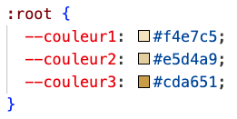

## A faire:

[Voir le site](https://lsanchezsavarit.github.io/Stage-Yoga/)

- changer les photos dans le dossier "image"

  - penser à bien conserver les mêmes noms de fichiers (exemple : `auriane.png` doit rester `auriane.png`)
  - astuce : le plus sera peut-être de faire dans cette ordre pour changer une image
    - ajouter nouvelle image
    - supprimer l'ancienne
    - renommer la nouvelle avec le même nom que l'ancienne
  - j'ai mis des logos différents pour chaque image pour que tu puisses t'y retrouver plus facilement (exemple : `lena.png` c'est le logo spotify, etc)

- changer le lien du google form vers le votre

  - il est présent 2 fois dans la page : une fois au début et une fois à la fin

- changer le mail à la fin (tu peux aussi mettre un numéro de téléphone à la place)

- aller ajouter le nom de domaine dans les réglages :

  - `Settings` > `Pages`
  - Ensuite tu devrais trouver une section qui s'appelle `Custom domain`

- changer le contenu (présentation, programme etc). Mais ça devrait pas être très compliqué.

- changer les couleurs
  - pour changer les couleurs de fond, tu as juste besoin de changer un bout de code tout en haut de `styles.css` :
    
  - si tu changes `couleur1` par exemple, ça va automatiquement changer tous les endroits où cette couleur est utilisée
  - c'est une pratique assez commune quand on fait un site web d'avoir 2 ou 3 couleurs qui se répètent à quelques endroits pour avoir un genre de thème
  - je te recommande de changer uniquement ces couleurs, et de tester pour voir à quoi ça ressemble quand tu en changes une
